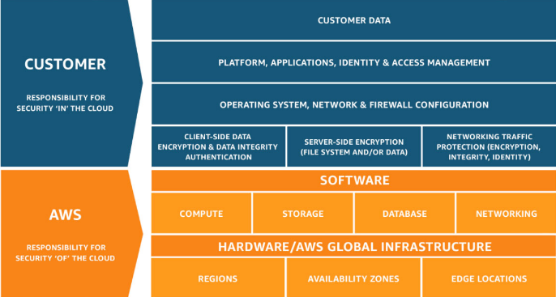

# Chapter Fifteen: Security and Compliance Services

## AWS Shared Responsibility Model
---

### What Is the Shared Responsibility Model? (Simplified)

The Shared Responsibility Model defines what you (as an AWS account holder/user) and Amazon Web Services are responsible for when it comes to security and compliance.

### AWS Definition of Shared Responsibility Model

**Security and compliance is a shared responsibility between AWS and the customer**. This shared model can help relieve customers' operational burden as AWS operates, manages, and controls the components from the host operation system and virtualization layer down to the physical security of the facilities in which the service operates. The customer assumes responsibility and management of the guest operation system (including updates and security patches), other associated application software as well as the configuration of the AWS provided security group firewall.

### Shared Responsibility Model --- EC2 Example

**AWS** is responsible for:
- The setup and maintenance of the physical hardware located at each AWS data center
- The physical security of data centers (locks, keys, security guards, etc.)
- The setup and maintenance of the host virtualization software

**You** are responsible for:
- Network-level security (NACLs, security groups)
- Operation System patches and updates
- IAM user access management
- Client- and server-size data encryption

 

## Security and Compliance on AWS
---

### DDoS and Penetration Testing

AWS customers are now welcome to carry out **security assessments or penetration tests** against some of their AWS infrastructures **without prior approval**. This applies to eight services:
- Amazon EC2 instances, NAT Gateways, and Elastic Load Balancers
- Amazon RDS
- Amazon CloudFront
- Amazon Aurora
- Amazon API Gateway
- AWS Lambda and Lambda Edge functions
- Amazon Lightsail resources
- Amazon Elastic beanstalk environments

### Prohibited Activities

These activities are **not** allowed at this time:
- DNS zone walking via Amazon Route 53 hosted zones
- Denial of Service (DoS), distributed denial of service (DDoS), simulated Dos, simulated DDoS
- Port flooding
- Protocol flooding
- Request flooding (login request flooding, API request flooding)

### Other AWS Security-Related Services

- **AWS Organizations** allows for centralized management of AWS accounts and billing, but it can also define policies that restrict, at the account level, what services and actions member accounts may take.
- **Amazon GuardDuty** is a threat detection service that provides a way to continuously monitor and protect AWS accounts and workloads. GuardDuty uses threat intelligence feeds to detect threats to the environment. GuardDuty is designed to actively protect the environment from threats.
- **Amazon Inspector** analyzes the VPC environment for potential security issues. Inspector uses a defined temple and assesses the environment. It provides the findings and recommends steps to resolve any potential security issues found.
- **AWS Shield** provides managed DDoS protection. DDoS attacks happen when multiple compromised systems attempt to flood a target with traffic. That target could be DNS, a web application, or a network.
- **AWS Web Application Firewall (WAF)** monitors web requests forwarded by an ELB, CloudFront, or API Gateway. WAF can allow or deny access to content based on specified conditions.
- **AWS Artifact** is a portal that provides access to AWS' compliance documentation, such as payment car industry (PCI) and ISO certifications, and System and Organization Control (SOC) reports.

 

## AWS Key Management Service
---

AWS KMS enabled encryption of data and provides centralized encryption key storage, management, and auditing. The data lay be encrypted for use with applications or to encrypt data stored on AWS.

**Key facts** about KMS:
- Keys may be generated in KMS, in an AWS CloudHSM hardware cluster, or you may import keys from your own encryption key service.
- Data is submitted directly to KMS for encryption/decryption using the master keys.
- KMS integrates with other AWS services, including:
	- S3 and Glacier
	- Storage Gateway
	- EBS and RDS
	- DynamoDB
	- SNS
	- CloudTrail

 

## Security and Compliance: Just the FAQs (Summary)
---

### Shared Responsibility Model

- The Shared Responsibility Model outlines what AWS is responsible for (security **of** the cloud) and what the customer is responsible for (security **in** the cloud).

### DDoS and Penetration Testing

- Distributed denial of service (DDoS) attacks to flood and overwhelm a server/services in an attempt to cripple or crash the service.
- Services such as CloudFront and Route 53 may be used together to expand the attack surface and minimize the impact of a DDoS attack

### Other AWS Security Services

- AWS Artifact provides access to security and compliance reports on the AWS infrastructure.
- AWS Inspector proactively monitors the infrastructure for vulnerabilities and deviations from best practices.
- AWS Shield provides managed protection against DDoS attacks.
- AWS WAF (Web Application Firewall) works with services such as EC2 and ELB, monitors web requests, and can filter traffic based on specified conditions.
- **Amazon GuardDuty is a threat detection service that provides a way to continuously monitor and protect AWS accounts.**
- AWS Organizations can be used to restrict access to various services from the account level.
- KMS is a service that manages encryption key storage. KMS integrates with several services, including S3 and Storage Gateway