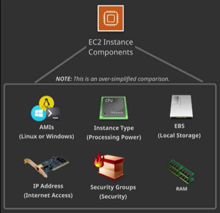

# Chapter Seven: Elastic Compute Cloud (EC2)

## Overview of Compute Services
---

### What Is EC2? (Simplified)

Think  of EC2 (Elastic Compute Cloud) as a basic computer.

### AWS Definition of EC2

Amazon Elastic Compute Cloud provides **scalable computing capacity** in the Amazon Web Services cloud. Using Amazon  EC2 eliminates your need to invest in hardware up front, so you can develop and deploy applications faster. You can use Amazon EC2 to **launch as many or as few virtual servers as you need**, configure security and networking, and manage storage. Amazon EC2 enables you to scale up or down to handle changes in requirements or spikes in popularity, reducing your need to forecast traffic.

### EC2 Instance Purchasing Options (Most Common):

- **On Demand**:
		On-demand purchasing allows you to choose any **instance type** you like and provision/terminate it at any time (on-demand).
		1. This is the **most expensive** and **most flexible** purchasing option.
		2. You are only charged when the instance is **running** (and billed by the hour).
		3. You can provision/terminate an on-demand instance at any time.
- **Reserved**:
		Reserved purchasing allows you to purchase an instance for a **set time period** of one (1) or three (3) years.
		1. This allows for a **significant price discount** over using on demand.
		2. You can select to pay upfront, partial upfront, no upfront.
		3. Once  you buy a reserved instance, you own it for the selected time period and are **responsible for the entire price** - regardless of how often you use it.
- **Spot**:
		Spot pricing is a way for you to **"bid"** on an instance type, and then only pay for and use that instance when the spot price is **equal to or below** your "bid" price.
		1. This option allow Amazon to sell the use of **unused instances**, for short amounts of time, at a **substantial discount**.
		2. Spot prices fluctuate based on supply and demand in the spot marketplace.
		3. You are **charged by the minute**.
		4. When you have an active bid, an instance is **provisioned for you when the spot price is equal to or less than your bid price**.
		5. A provisioned instance **automatically terminates when the spot price is greater than your bid price**.

<i>**UPDATE: You no longer have to "bid". You pay the spot price that is in effect for the hour the instances are launched.**</i>

 

### How Are You Charged?

Free Tier use is available for EC2

**1 ) Purchasing Options**:
	Most common (not an inclusive list)
	- On demand
	- Reserved
	- Spot
**2) Instance Type**: The instance's processing capacity (think CPU)
	- General purpose
	- Compute optimized
	- Accelerated computing
	- Memory optimized
	- Storage optimized
**3 ) EBS Optimized**: An option for higher IOPS (Input, Output, operation Per Second) performance
**4) AMI Type**: Think operation system
	- Linux (price varies based on distro/software packages)
	- Windows (price varies based on version/software packages)
**5 ) Data Transfer**: In/Out of the instance
**6 ) Region**: In which the instance is provisioned

### Benefits & Use Cases:

- **Additional Benefits**
	- Elastic web-scale computing
	- Full root control of the server
	- Flexible options (many instance types, AIM's to choose from)
	- Integrates with almost all other AWS services
	- Extremely reliable
	- High level of built-in security
	- Inexpensive
	- Very easy to start (create an EC2 instance within minutes)

- **Primary Use Cases**
	- Multi-tier web applications
	- Web-servers
	- Batch processing
	- Video processing
	- GPU intensive workloads

 

## Elastic Compute Cloud (EC2) Instances Part 1
---

### What Is an AMI? (Simplified)

A preconfigured package required to launch an EC2 instance that includes an **operation system**, software packages, and other required settings.

### AWS Definition of AMI

An Amazon Machine Image (AMI) **provides the information required to launch and instance**, which is a virtual server in the cloud. You specify an AMI when you launch an instance, and you can launch **as many instances from the AMI** as you need. You can also launch instances from as many different AMIs as you need.

### AMI Options:

- **Community AMIs**
	- Free to use
	- Generally, with these AMIs, you just select the OS you want
- **AWS Marketplace AMIs**
	- Pay to use
	- Generally comes packaged with additional, licensed software
- **My AMIs**
	- AMIs you create yourself

### What Is an Instance Type? (Simplified)

The CPU (**central processing unit**) of your instance.

### AWS Definition of an Instance Type

When you launch an instance, the **instance type** that you specify determines the **hardware of the host computer** used for your instance. Each instance type offers different **compute, memory, and storage capabilities** and are grouped in instance families based on these capabilities. Select an instance type based on the requirements of the application or software that you plan to run on your instance.

### Instance Type Options:

- General purpose
- Compute optimized
- GPU optimized
- Memory optimized
- Storage optimized

### Instance Type Components

- **Family**: A way of categorizing instance types based on what they are optimized to do.
- **Type**: Subcategory for each family type.
- **vCPUs**: The number of virtual CPUs the instance type uses.
- **Memory (GiB)**: The amount of RAM the instance type uses.
- **Instance Storage (GB)**: The local instance storage volume (your hard drive).
- **EBS-optimized available**:  Indicated if EBS-optimized is an option for the instance type.
- **Network performance**: Network performance rating based on its data transfer rate (bandwidth capacity).

### What Is EBS? (Simplified)

EBS is a **storage volume** for an EC2 instance. (Think of it as a **hard drive**)

### AWS Definition of EBS

Amazon Elastic Block Storage provides block-level storage volumes for use with EC2 instances. EBS volumes are **highly available and reliable storage volumes that can be attached to any running instance that is in the same Availability Zone**. EBS volumes that are attached to an EC2 instance are exposed as **storage volumes that persist independently from the life of the instance**.

	1. Every EC2 instance MUST have a root volume, which may or may not be EBS.
	2. By default, EBS root volumes are set to be deleted when the instance is terminated. However, you can choose to have EBS volumes persist after termination
	3. During the creation of an EC2 instance (or anytime afterwards), you can add additional EBS volumes to the instance.
	4. Any additional volume can be attached or detached from the instance at any time, and it NOT deleted (the default) when the instance is terminated.

 

## Elastic Compute Cloud Instances Part 2
---

### What are Security Groups? (Simplified)

Security groups are very similar  to NACLs, in that they **allow or deny traffic**. However, security groups are found on the **instance level** (as opposed to the subnet level). In addition, the way **allow/deny rules work are different from NACLs**.

### AWS Definition of Security Groups

A security group acts as a **virtual firewall that controls the traffic for one or more instances**. When you **launch an instance, you associate one or more security groups with the instance**. You add rules to each security group that allow traffic to or from its associated instances. You can modify the rules for a security group at any time; the new rules are automatically applied to all instances that are associated with the security group. When we decide whether to allow traffic or reach an instance, we evaluate all the rules from all the security groups that are associated with the instance.

 

## Compute: Just the FAQs (Summary)
---

- Compute is made up of several components, including and operation system, CPU, hard drive, network card, security and RAM.
- AWS has several compute offerings including EC2.
- EC2 has several purchasing options, including:
	- **On-Demand**: The default and most expensive option
	- **Reserved Instances**: Based on a time commitment of one or three years.
	- **Spot Instance**: Based on bid pricing
		- Spot instances are used for services when the compute can be shut down and restarted at any time without impacting services.
- EC2 uses EBS to work as local storage for the instance.
- AMIs are an image (prepackaged operation system, applications and configuration) for an instance.
- Security groups act as a firewall (security) for EC2 instances.
- Connecting to a Linux instance using SSH is different from  a Windows computer using PuTTY versus connecting from Terminal on a Mac/Linux system.
- Remote Desktop is used to connect to a  Windows EC2 instance.

 

## Elastic Compute Cloud (EC2): Quiz (Correct answers only!)
---

- **By default, Security Groups you create __.**
	- allow all outbound traffic and deny all inbound traffic unless it is return traffic.
- **In this scenario, we have an increase in traffic on a holiday sale. What EC2 purchasing option should we use to acquire the resources to handle the traffic?**
	- On-Demand
- **What does EC2 stand for?**
	- Elastic Compute Cloud
- **Which of the following is not an available EC2 Instance Type?**
	- Database Optimized
- **What should the permissions of a key pair (.pem file) be before connecting to an EC2 instance?**
	- 400
- **NACLs _ traffic on the _.**
	- allow/deny, subnet level
- **Which computer component provides a connection to the internet?**
	- Network Card
- **An EBS volume is a _____.**
	- highly available and reliable storage volume
	- storage volume that can be attached to any instance in the same AZ (Availability Zone)
- **Which of these components does a security group represent for an EC2 instance?**
	- Firewall