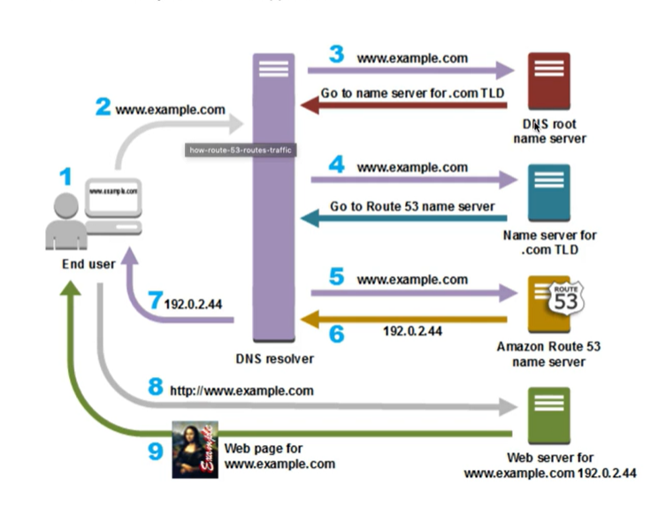

# Chapter Ten: CloudFront and DNS

## Route 53 and DNS
---

### What Is Route 53? (Simplified)

Route 53 is where you **configure and manage web domains for websites or application you host on AWS.**

### AWS Definition of Route 53

Amazon Route 53 performs three main functions:
- **Domain registration**: Amazon Route 53 lets you register domain names such as example.com
- **Domain Name System (DNS) service**: Amazon Route 53 translates friendly domain names like www.example.com into IP addresses like 192.0.2.1. Amazon Route 53 responds to DNS queries using a global network of authoritative DNS servers, which reduces latency.
- **Health checking**: Amazon Route 53 send automated requests over the internet to your application to verify that it's reachable, available and functional.

 

## CloudFront
---

### What Is CloudFront? (Simplified)

CloudFront is a content delivery network (CDN) that allows you to store (cache) your content at "edge locations" located all around the world. This allows your customers to access your content more quickly (and also provides additional security - especially against DDoS attacks).

### AWS Defininition

Amazon CloudFront is a global content delivery network (CDN) service that securely delivers data, videos, applications, and APIs to your viewers with low latency and high transfer speeds. CloudFront is integrated with AWS - both physical locations that are directly connected to the AWS global infrastructure, as well as software that works seamlessly with services including AWS Shield for DDoS mitigation, Amazon S3, Elastic Load Balancer, or Amazon EC2 as origins for your applications, and AWS Lambda to run custom code close to your viewers.

 

## CloudFront and DNS: Just the FAQs (Summary)
---

- Route 53
	- Domain registration
	- Domain Name System (DNS) service
	- Traffic flow (send users to the best endpoint)
	- Health checking
	- DNS failover (automatically change domain endpoint if system fails)
	- Integrates with ELB, S3, and CloudFront as endpoints
- CloudFront
	- Cache content at edge locations for fast distribution to customers
	- Built-in distributed denial of service (DDoS) attack protection
	- Integrates with many AWS services (S3, EC2, ELB, Route 53, Lambda)

 

## CloudFront and DNS: Quiz (Correct answers only!)
---

- **What are the three main functions of Route 53?**
	- Domain Registration
	- DNS (Domain Name System) service
	- Health Checks
- **In this scenario, we want to purchase a domain name with AWS. Which AWS service would we use?**
	- Route 53
- **What is Route 53?**
	- DNS service
- **Which of these AWS services does CloudFront integrate with for DDoS protection?**
	- AWS Shield
- **Which AWS service allows you to configure a DNS record set?**
	- Route 53