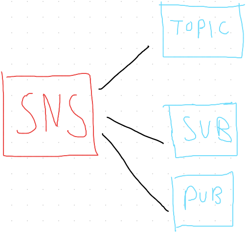

# Chapter Twelve: Notification Services

## Simple Notification Service (SNS)
---

### What Is Simple Notification Service? (Simplified)

An AWS service that allows you to **automate the sending of email or text message notification, based on events** that happen in your AWS account.

### AWS Definition of Simple Notification Service

Simple Notification Service is a web service that **coordinates and manages the delivery or sending of messages to subscribing endpoints or clients**. In Amazon SNS, there are two types of clients - **publishers and subscribers** - also referred to as producers and consumers. **Publishers** communicate asynchronously with subscribers by producing and sending a message to a topic, which is a logical access point and communication channel. **Subscribers** (ex: web servers, email addresses, ...) consume or receive the message or notification over one of the supported protocols (ex: Amazon SQS, HTTP/S, email, SMS, ...) when they are subscribed to the topic.

### SNS Basics:

- **Topic**:
	- How you label and group different **endpoints** that you send messages to
- **Subscriptions**:
	- The endpoints that topic sends messages to (ex:  the email address or phone number of our system admin)
- **Publishers**:
	- The human/alarm/event that gives SNS the message that needs to be sent

### SNS Benefits:

- Send automated or manual notifications
- Send notifications to email, mobile (SMS), and HTTP endpoints
- Closely integrates with other AWS services (such as CloudWatch) so that alarms, events and actions in your AWS can trigger notifications

 

## Monitoring, Logging, and Notifications: Quiz (Correct answers only!)
---

- **In this scenario, we want to set up a service that will allow for auditing IAM users. Which of the following services would be most appropriate?**
	- CloudTrail
- **Which of the following is not a way SNS can send a notification?**
	- Phone call
- **CloudWatch is a service for _____.**
	- Monitoring AWS resources
- **In this scenario, we want to automate emails and SMS messages for events taking place in an AWS account. Which of the following services is the most appropriate?**
	- SNS
- **What AWS service is triggered to send a message by a CloudWatch Alarm?**
	- SNS
- **The components of SNS are _____.**
	- Subscribers
	- SNS Topics
	- Publishers

