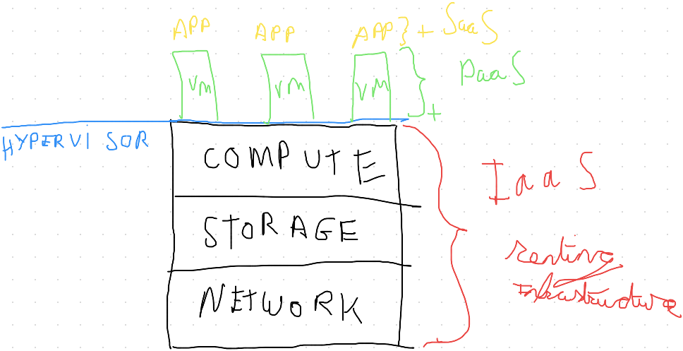
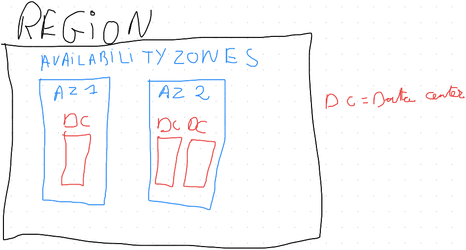

# Chapter Two: What are clouds made of?

## In the Beginning, Before There Was a Cloud
---

- Server Sprawl → New Application = New Server → Resulting in data centers running out of space
    - Data center challenges: Sprawl / Space, Power and Cooling

- Business Challenges
	- Cost Control
	- Distributed Workforce
	- Slow Provisioning
		- (Time to test, prepare and provision can slow business initiatives)

 

## What Are Clouds Made Of?
---

- Cloud Computing Services
	- **IaaS**: Infrastructure as a Service
	- **PaaS**: Platform as a Service
	- **SaaS**: Software as a Service

- Infrastructure as a Service (Compute | Storage | Network)
	- Part or all of an infrastructure is provided by third party
- Platform as a Service
	- Entire infrastructure and operation system is provided by third party
- Software as a Service
	- Entire infrastructure, operating system and software is provided by third party (ex. Email Clients, Dropbox, ...)

### Types of Clouds:

| Private Cloud (On Premise) | Hybrid Cloud (Part Private, Part Public) | Public Cloud (Cloud/AWS) |
| ----------- | ----------- | ----------- |
|      Fully Customizable       |   Often used as transition to public cloud          |  No Capital Costs           |
|      Higher Security       |     Sometimes used for backup/Disaster Recovery        |  Pay as you go           |
|      Capital Cost       |   Add Flexibility and Scalability          |  Low Overhead           |
|      High Overhead       |  Streamlined application accessibility for remote workers           |   Infinite Scalability          |
|      Lack of Elasticity       |             |    Elasticity         |
|      Potential Latency       |             |   Some Restrictions          |
|             |             |    Governance Challenge (ex: GDPR)         |
|             |             |    Faster and Simplified deployments         |

### Terminology:

- **Scalability**
	- Easily grow in size, capacity and/or scope when required (based on demand)
- **Elasticity**
	- Ability not only to grow (scale) but when required reduce in size
- **Fault Tolerance**
	- Ability to withstand a certain amount of failure and still be functional (self-healing)
- **High Availability**
	- The concept of being accessible when you attempt to access it (and/or accessible via multiple platforms)

 

## Primary Benefits of Cloud/AWS
---

### Ease of Use:

- **AWS Console**
	- Graphical User Interface
	- Access to AWS Services
- **API Access**
	- Interact programmatically with AWS Services
	- Access to AWS Services
	- Command line access 

### Flexibility:

Choose as many AWS services  as needed. You receive a virtual platform from AWS, and you load the software services you need to support your application.

### Cost-Effectiveness:

Pay only for the amount of services you need. There are no long-term contracts or up-front commitments. Discounts are provided for certain services reserved for a minimum period of time.

### Scalability & Elasticity:

Scalability gives us the ability to add resources on demand to accommodate growth. Elasticity means it's designed to grow and shrink on demand based on need.

### High Availability & Fault Tolerance:

When an environment is fault tolerant, it is able to withstand the loss of a component within the infrastructure while remaining functional. High availability is the ability of a system to remain in an operational state for a long period of time. Highly available systems are able to stay operational during maintenance and system failures.

 

## AWS Global Infrastructure
---

The AWS Global Infrastructure consists of 21 regions and 64 availability zones.

- **Availability Zones (AZs)**
	- Availability Zones (within a region) work together to make up a collection of your AWS resources. Properly designed applications will utilize multiple Availability Zones for **high availability** and **fault tolerance**. AZs have directly low latency connections between each other, and each AZ is isolated from the others to ensure fault tolerance.
- **Data Centers**
	- Located in each Availability Zone is one or more AWS data centers, which contain the physical server that run AWS Services.

- **Benefits for the User:**
	- Provision resources closest to the people that will use them
	- Multiple AZs and regions means the AWS infrastructure is fault tolerant
	- Expands high availability beyond a single geographical area
	- Applications may be configured for high availability by provisioning them in multiple  regions for failover/disaster recovery

 

## So That's What Clouds (AWS) Are Made Of
---

- **Compute (2 Primary Components):**
	- EC2 → Virtual Server (Instances) → Install OS, Applications, Update Software, . . .
	- Lambda →Serverless → Don't need to worry about configuration it your self → User only writes code to execute tasks, AWS manages the rest.
- **Networking:**
	- Direct Connect →  Connect corporate infrastructure/network with high speed, low latency connection to the AWS environment
	- Route 53 → Domain Name Server (DNS)
- **Storage:**
	- S3 → Bulk File storage
	- Glacier → Same as S3 but for long term storage (data that you know you don't need frequently)

 

## What Are Clouds Made Of?: Just the FAQs (Summary)
---

- **Before There Was a Cloud**
	- Traditional architecture and challenges with space, power, cooling, cost and support requirements
- **What Is the Cloud?**
	- Infrastructure as a Service
	- Platform as a Service
	- Software as a Service
- **Types of Clouds**
	- Public
	- Private
	- Hybrid
- **Terminology**
	- Elasticity, scalability, high availability,  and fault tolerance
- **Primary Benefits of Cloud**
	- Flexibility, pay as you go,  elasticity, scalability,  high availability, and fault tolerance
- **AWS Global Infrastructure**
	- Regions
	- Availability Zones
	- Data centers
- **So That's What Clouds Are Made Of**
	- Compute
	- Storage
	- Networking

 

## What Are Clouds Made Of? (Quiz / Correct answers only!)
---

- **Which of these is descriptive of an Availability Zone?**
	- An Availability Zone is an area containing datacenters in which AWS resources are available.
- **The AWS cloud is a ___.**
	- Public Cloud
- **Which of the following are AWS computing services?**
	- EC2
	- Lambda
- **Which of the following is an example of SaaS?**
	- All of the infrastructure, operating system and software are provided by a third party.
- **What type of cloud is used by traditional on-premise methods?**
	- Private Cloud
- **Which of the following are AWS networking services?**
	- Route 53
	- AWS Direct Connect
	- VPC
- **Which of the following are examples of storage?**
	- Remote Hard Disk
	- Google Drive
	- iCloud
	- Local Hard Disk
	- Dropbox
- **Which of the following stores data in a structured way such as table, so that it may be easily retrieved?**
	- Database
- **Which of these cloud terminologies represents the benefit of the cloud to grow and shrink infrastructure based on demand?**
	- Elasticity
- **Which of these is an example of the hierarchy in AWS global infrastructure from largest to smallest?**
	- AWS Global Infrastructure, AWS Regions, Availability Zones, and Data Center
- **Which of these is NOT a general category of AWS services?**
	- Internet
- **How does Elasticity differ from Scalability?**
	- Elasticity differs in its ability  to not only scale-out but to shrink back down resources based on-demand as well.