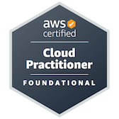

# AWS-Certified-Cloud-Practitioner

### Verify my certificate
https://www.credly.com/badges/faefa194-c759-486a-a093-43d2cbc9b750/public_url

The notes I created and used to study for the AWS Certified Cloud Practitioner exam! (use at your own risk)

| Chapter      | Link |
| ----------- | ----------- |
| Chapter 1: Getting Started      | No Page       |
| Chapter 2: What Are Clouds Made Of?   | [Chapter Two](./Chapters/Chapter%20Two.md) |
| Chapter 3: Lets Get Started: What You Need to Know   | [Chapter Three](./Chapters/Chapter%20Three.md) |
| Chapter 4: Seeing the Big Picture   | [Chapter Four](./Chapters/Chapter%20Four.md) |
| Chapter 5: IAM: Managing Users, Groups, and Roles   | [Chapter Five](./Chapters/Chapter%20Five.md) |
| Chapter 6: Virtual Private Cloud   | [Chapter Six](./Chapters/Chapter%20Six.md) |
| Chapter 7: Elastic Compute Cloud (EC2)   | [Chapter Seven](./Chapters/Chapter%20Seven.md) |
| Chapter 8: AWS Storage Services   | [Chapter Eight](./Chapters/Chapter%20Eight.md) |
| Chapter 9: ELB and Auto Scaling   | [Chapter Nine](./Chapters/Chapter%20Nine.md) |
| Chapter 10: CloudFront and DNS   | [Chapter Ten](./Chapters/Chapter%20Ten.md) |
| Chapter 11: Monitoring and Logging   | [Chapter Eleven](./Chapters/Chapter%20Eleven.md) |
| Chapter 12: Notification Services   | [Chapter Twelve](./Chapters/Chapter%20Twelve.md) |
| Chapter 13: SQL and NoSQL   | [Chapter Thirteen](./Chapters/Chapter%20Thirteen.md) |
| Chapter 14: Serverless   | [Chapter Fourteen](./Chapters/Chapter%20Fourteen.md) |
| Chapter 15: Security and Compliance Services   | [Chapter Fifteen](./Chapters/Chapter%20Fifteen.md) |
| Chapter 16: Other Noteworthy AWS Services   | [Chapter Sixteen](./Chapters/Chapter%20Sixteen.md) |
| Chapter 17: AWS Pricing, Billing, and Support Services   | [Chapter Seventeen](./Chapters/Chapter%20Seventeen.md) |